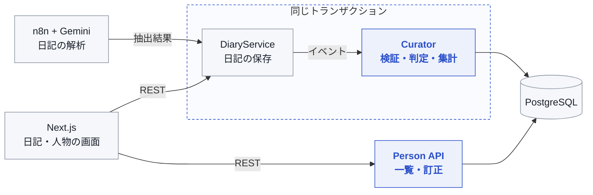
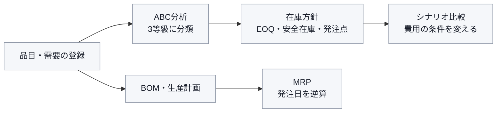

# 朱 韓榮 ｜ JU HAN YOUNG

**バックエンドエンジニア志望**

*業務のルールを、正しく動くデータと計算に。*

---

## 🛠 Tech Stack

| 分野 | 技術 |
| --- | --- |
| Backend | `Java` `Spring Boot` `Spring Data JPA` |
| Database | `PostgreSQL` |
| Test | `JUnit 5` `Mockito` `AssertJ` |
| Frontend | `React` `Next.js` `TypeScript` |

---

## 📔 TADA ｜ AIダイアリーアプリ

> **チーム開発（5名）** · 2026.08 – 09 · 担当：人物キュレーター（API・画面）

日記を書くと、AIがステッカーを作ってカレンダーに残すサービスです。 
日記に出てくる人物を判定し、人ごとに日記をまとめる機能を担当しました。

🟦 青い部分が担当範囲

#### ✨ 取り組んだこと

| | 内容 |
| --- | --- |
| **人物判定** | 似た名前を誤ってまとめない4段階の判定 |
| **同時保存** | 人物の行をロックしてから読み、上書きと主キーの衝突を防ぐ |
| **訂正・修正** | AIの候補と確定した人物を分離、本文修正は KEEP / ADD / REMOVE |
| **テスト** | 128件（人物判定 74件） |

#### 同時保存の追加検証（2026-10-06）

手元のWindows PC、Java 21、PostgreSQL 17.11、READ COMMITTEDで、同じ人物に2件の日記を並列保存する条件を各50回測定しました。

| 条件 | 既存の集計 | 初登場 |
| --- | --- | --- |
| ロックなし | 0/50正常（古い集計の上書き） | 0/50正常（主キー衝突） |
| 読んでからロック | 0/50正常（古い集計） | 0/50正常（古い集計） |
| 現在の順序：ロック → 読み取り | 50/50正常 | 50/50正常 |

現行の `PersonAggregateService` を無変更で再コンパイルし、JDBCのリポジトリアダプターで測定しています。比較条件ではバリアを使い、競合する読み取りを意図的に同期しました。通常利用時の障害率や性能測定を示すものではありません。Spring/JPAと日記API全体の統合検証は今後の課題です。

🔗 **Code** ▸ [Backend（Curator）](https://github.com/hanyx-00/tada-was/tree/main/src/main/java/com/tada/tada/curator) · [Frontend（Curator）](https://github.com/hanyx-00/tada-frontend/tree/main/domains/curator)　|　**Demo** ▸ [tada-frontend-seven.vercel.app](https://tada-frontend-seven.vercel.app)

---

## 📦 RESTOCK ｜ 在庫発注シミュレーター

> **個人開発** · 2026.09 · 担当：設計から画面まですべて

需要の履歴から、在庫の発注量と発注日を計算するサービスです。 
ABC分析・EOQ・安全在庫・MRPを、バックエンドから画面まで実装しました。

#### ✨ 取り組んだこと

| | 内容 |
| --- | --- |
| **安全在庫** | ABC等級に応じて基準（サービス水準）を変える |
| **MRP** | 部品構成と生産計画から、発注日を逆算する |
| **検証** | 計算のテスト7件と手計算で結果を確認 |
| **構成** | Java 21 · Spring Boot 4.1 · PostgreSQL · React 19 |

🔗 **Code** ▸ [restock](https://github.com/hanyx-00/restock)

---

## 💡 開発で大切にしていること

1. **業務のルールを先に整理する** — 入力・単位・判断の条件を決めてから実装する
2. **データの整合性を守る** — 訂正や同時保存のあとも、数がずれない構造にする
3. **結果を確かめる** — テストと手計算で、判断の根拠を残す

---

📫 **Contact** ▸ a98220919@gmail.com

